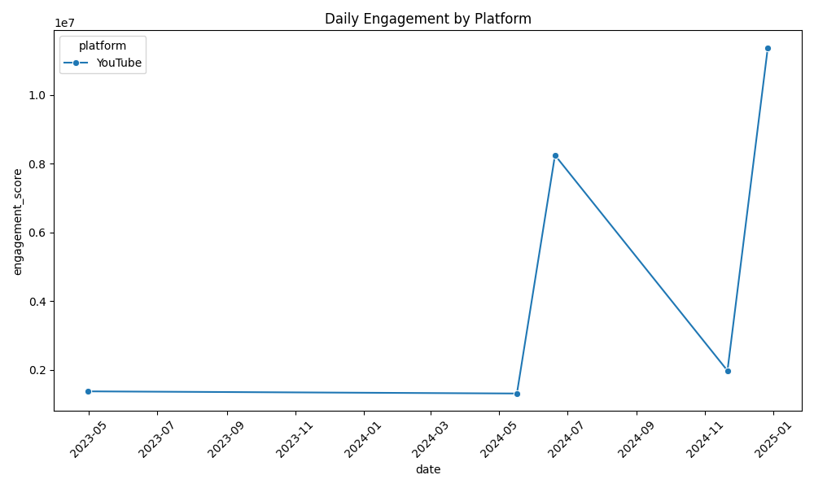
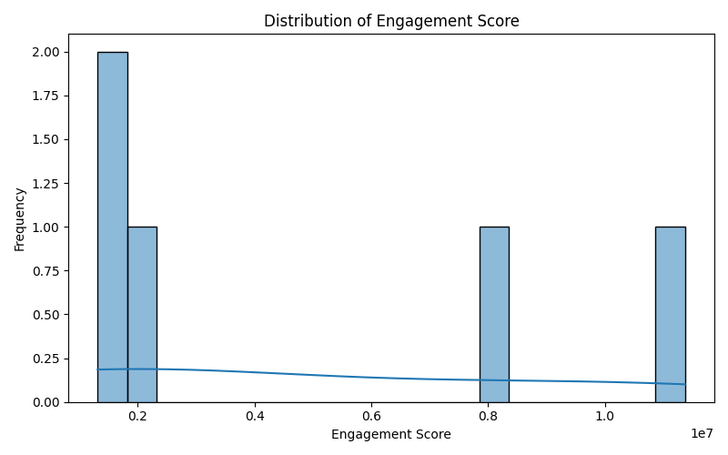

# Social Media Analytics Pipeline

This project is a **data pipeline for social media analytics**.  
It collects posts from **Twitter** & **YouTube**, processes and analyzes them, and outputs insights such as **engagement metrics, top posts, and trending words**, with visualizations and CSV exports.

---

##  Table of Contents
- [Overview](#overview)
- [Features](#features)
- [Project Structure](#project-structure)
- [Installation](#installation)
- [Configuration](#configuration)
- [Usage](#usage)
- [Output Examples](#output-examples)
- [Docker Setup](#docker-setup)
- [Analysis Modules](#analysis-modules)
- [Contributing](#contributing)
- [License](#license)

---

##  Overview
The pipeline automates the process of:
1. **Extracting** data from Twitter and YouTube.  
2. **Transforming** (cleaning & normalizing) posts.  
3. **Enriching** data with engagement scores.  
4. **Analyzing** metrics and trends.  
5. **Visualizing** results as plots.  

---

##  Features
- Twitter & YouTube data ingestion.  
- Data cleaning & normalization.  
- Engagement scoring (`likes + comments + shares`).  
- Metrics:
  - Top 5 posts overall
  - Top 3 posts per platform
  - Daily engagement
  - 7-day moving averages
  - Most common words in posts
- Visualization:
  - Daily engagement trend (PNG)
  - Engagement score distribution (PNG)
- Save results to CSV.  
- Airflow DAG for scheduling.  
- Dockerized for deployment.  

---

## 📂 Project Structure
```bash
analytics/
│── dags/
│   └── social_media_etl.py
│
│── extract/
│   ├── twitter_api.py
│   └── youtube_api.py
│
│── transform/
│   ├── clean_normalize.py
│   └── enrich.py
│
│── load/
│   └── save_csv.py
│
│── analytics/
│   ├── metrics.py
│   └── moving_avg.py
│
├── output/
│   ├── daily_engagement.png
│   ├── engagement_distribution.png
│   └── social_media_posts.csv
│
├── config.py
├── docker-compose.yml
├── Dockerfile
├── main.py
└── requirements.txt
````

---

##  Installation

```bash
git clone https://github.com/Keroloshani47/social_media_pipeline.git
cd social_media_pipeline
pip install -r requirements.txt
```

---

##  Configuration

Update your API keys in `config.py`:

```python
TWITTER_BEARER_TOKEN = "your_twitter_bearer_token"
YOUTUBE_API_KEY = "your_youtube_api_key"
```

---

##  Usage

Run the full pipeline:

```bash
python main.py
```

Or run individual modules:

```bash
# Fetch Twitter posts
python analytics/extract/twitter_api.py --query "AI" --max_results 20

# Clean & normalize data
python analytics/transform/clean_normalize.py input.csv output.csv
```

---

##  Output Examples

**CSV Example (`output/social_media_posts.csv`):**

```csv
content,likes,comments,shares,post_date,platform,author_id,engagement_score
Which sports should we do next? 😂,1967288,10529,0,2024-11-21 18:50:12+00:00,YouTube,UCRijo3ddMTht_IHyNSNXpNQ,1977817
Sports You Never Knew Existed 👀,8234284,9488,0,2024-06-20 09:07:43+00:00,YouTube,UCblfuW_4rakIf2h6aqANefA,8243772
This sport looks tough 😱 (via @jaialaileague) #shorts,1369049,7334,0,2023-04-30 14:38:18+00:00,YouTube,UCiWLfSweyRNmLpgEHekhoAg,1376383
How Many People To Stop Ronaldo?,11345720,25671,0,2024-12-27 19:00:00+00:00,YouTube,UCX6OQ3DkcsbYNE6H8uQQuVA,11371391
Some sick skate skills! 🛹 🔥 @sisa_solymosyova,1310187,3540,0,2024-05-17 07:20:32+00:00,YouTube,UCTl3QQTvqHFjurroKxexy2Q,1313727
```

**Visualizations:**

* Daily Engagement Trend
  

* Engagement Score Distribution
  

---

##  Docker Setup

Build and run pipeline:

```bash
docker-compose up --build
```

This will:

* Run the ETL pipeline container (`social_media_etl`)
* Start Airflow (Web UI at [http://localhost:8080](http://localhost:8080), user: `admin`, pass: `admin`)

---

##  Analysis Modules

* **Data Ingestion** → `extract/` (Twitter, YouTube APIs).
* **Data Cleaning** → Normalize dates, numeric fields.
* **Enrichment** → Add engagement score.
* **Metrics** → Top posts, per-platform stats, daily & 7-day averages.
* **Visualization** → Daily trends & score distributions.
* **Export** → Save to CSV.

---

##  Contributing

Pull requests are welcome!
For major changes, please open an issue first.

---


